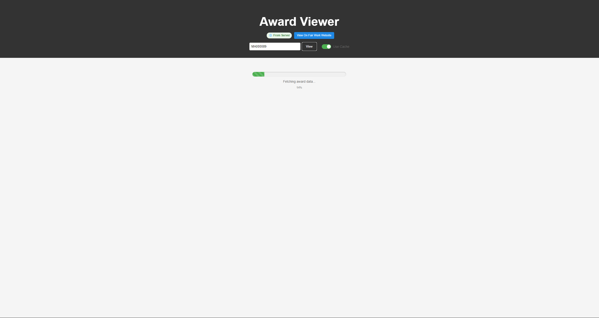
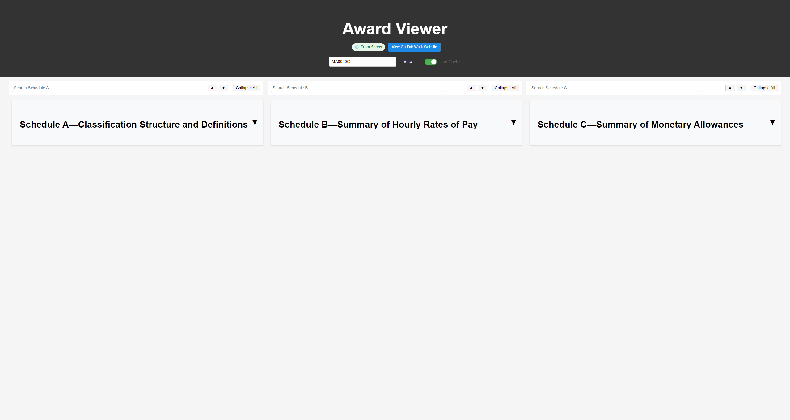
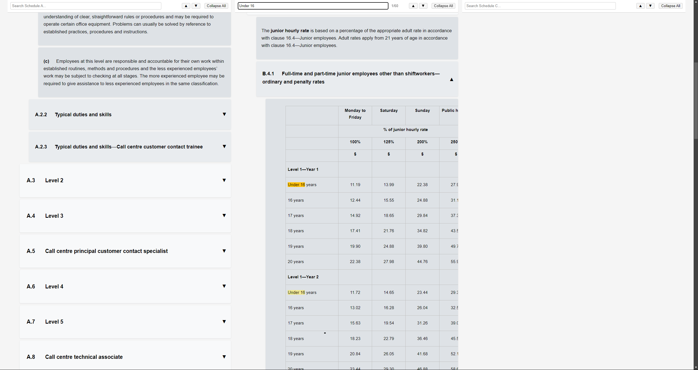

# Fast Pay Rate Access - Fair Work Award Pay Rates Viewer

Instantly access pay rates, classifications, and allowances across all Fair Work awards. No more waiting for calculators to process - get the information you need immediately.

👉 [Learn how it works in detail](HOW_IT_WORKS.md)

👉 [Demo](https://67516c3e6e19bbf90709ce7b--rad-starship-8a17f6.netlify.app/)

## Why This Solution?

The current PACT calculator, while functional, has several limitations:
- Long processing times that increase with each award lookup
- Must restart the entire process to change a single input
- Restricted to specific calculation paths
- Time-consuming for batch processing

Our solution provides immediate access to the information you need, when you need it.

## Performance Comparison

The graph above shows real-world timing comparisons between our solution and the PACT calculator. Two specific tests were conducted:

### Single Pay Rate Lookup
Looking up a pay rate for: Level 2 - Year 2, 16-year-old casual (Monday-Friday)
- Award Viewer: 17 seconds
- PACT Calculator: 36 seconds
- Time Saved: 19 seconds (53% faster)

### Multiple Pay Rate Lookups
Looking up four different pay rates in succession:
1. Level 2 - Year 2, 16-year-old casual (Monday-Friday)
2. Level 2 - Year 2, 17-year-old casual (Monday-Friday)
3. Level 2 - Year 1, 16-year-old full time (Monday-Friday)
4. Call centre principal customer contact specialist, adult full time (Monday-Friday)

Results:
- Award Viewer: 1 minute 12 seconds
- PACT Calculator: 3 minutes 21 seconds
- Time Saved: 2 minutes 9 seconds (64% faster)

The key difference: While PACT requires restarting the entire questionnaire for each lookup, our solution allows immediate access to any pay rate information through direct navigation and search.

## What You Get

Instant access to:
- Classification descriptions
- Hourly pay rates
- Monetary allowances

## Key Features

### Fast, Efficient Access
- Easy navigation between and within schedules
- Real-time search within content
- Quick navigation between search matches
- Expandable/collapsible sections for better readability

### Smart Caching System
- Toggle between cached and fresh data
- 24-hour cache validity
- Clear visual indicators showing data source (cached/fresh)
- Faster repeat lookups while maintaining data accuracy

### Direct Source Integration
- Links to official Fair Work website for verification
- Guaranteed accuracy through direct source access
- Works with all awards
- Always up-to-date information

## Benefits for HR

- Instant pay rate lookups
- Guaranteed accuracy with direct Fair Work source integration
- Peace of mind with easy verification via Fair Work website
- Compatible with all awards
- Always current information

<<<<<<< HEAD
This tool transforms the way HR professionals access Fair Work pay rates, making it faster and more efficient while maintaining absolute accuracy through direct source integration.

## Screenshots

### Initial Load

The loading screen shows a progress bar and clear status while fetching award data. The cache toggle and Fair Work verification link are always accessible.

### Award Overview

Once loaded, the award is organized into three columns showing Classifications (Schedule A), Pay Rates (Schedule B), and Allowances (Schedule C). Each section has its own search functionality and navigation controls.

### Expanded View

Clicking on sections expands them to show detailed information. Here you can see the expanded pay rates table with age-based rates and different time periods. The search feature helps quickly locate specific information within any schedule. 
=======
This tool transforms the way HR professionals access Fair Work pay rates, making it faster and more efficient while maintaining absolute accuracy through direct source integration. 